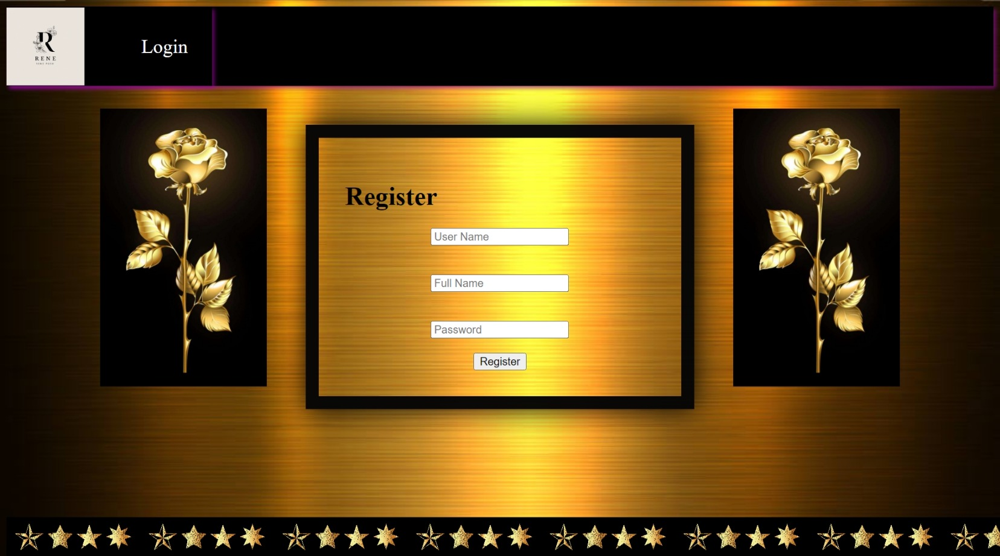
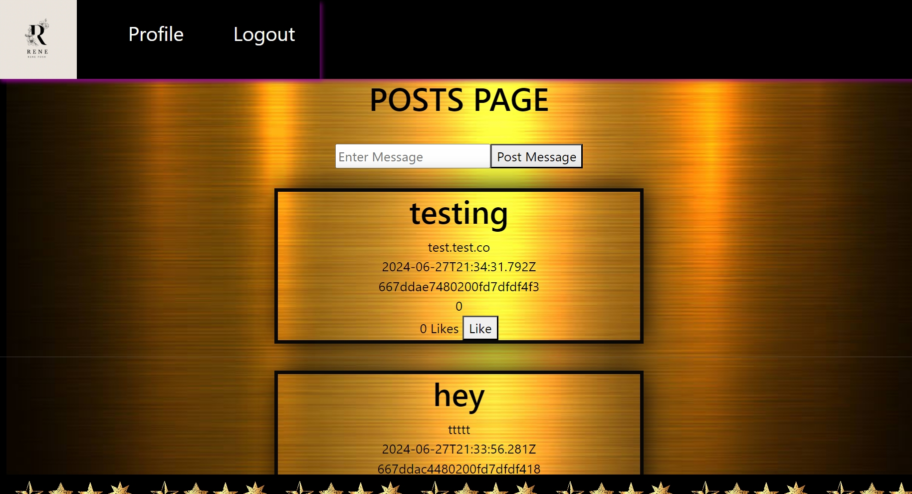
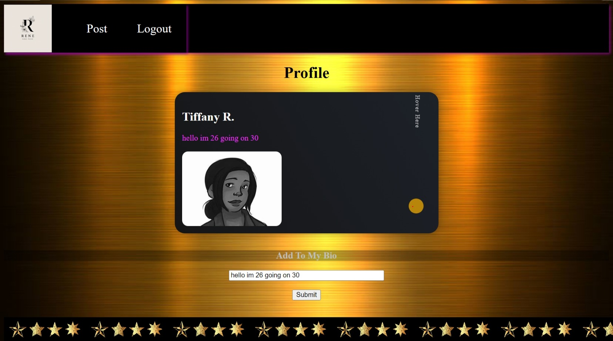

# Enjoy the Microblog Project and the MicroblogLite API!

Don't forget to read the [*MicroblogLite* API docs](http://microbloglite.us-east-2.elasticbeanstalk.com/docs) and experiment with the API in *Postman!*

Practice and experimentation provide experience, and experience provides confidence.

## Login page
Golden Fancy Look Topped With Gold Side Roses With a Hint of Purple to Cool Down the Look a bit, Ending With a Gold Star Footer. 

## Register Page
Golden Fancy Look Topped With Gold Side Roses With a Hint of Purple to Cool Down the Look it Was Made to Mimic the Login Page For a More Clean Feel, Ending With a Gold Star Footer.

## Post Page
My Post Page Gives A Organized Feel, it Has Blocks With Each Post That Is Generated, also Topped With That Golden Touch In The Background, Ending With a Gold Star Footer.

## Profile Page
The Profile Page Provides You With a Card to Add a Few Details About Yourself in The Bio, When You Hover The Golden Dot You Will See The Pronouns As well as Other Names. Also The Page Has The Golden Feel,it Gives a More Fancy Feel, Ending With a Gold Star Footer.

## LIVE VISUAL LINK
 https://tiffanyr2.github.io/microbloglite-capstone-starter/